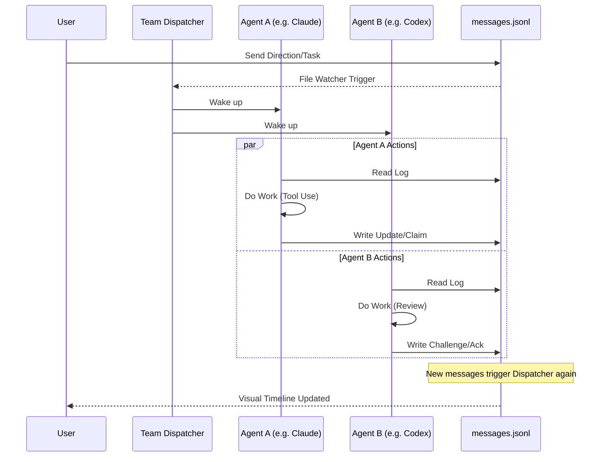

<p align="center">
  
</p>

<p align="center">
  
  &nbsp;
  
  &nbsp;
  
</p>

---

# Agent Team — Break the Black Box of Multi-Agent Coding

<p align="center">
  <em>Let Claude Code, Codex, and Gemini collaborate in one workspace — with you in the loop.</em>
</p>

---

## Why This Exists

This project is built on top of [AionUi](https://github.com/iOfficeAI/AionUi), an open-source Electron app for working with AI coding agents. AionUi is great at running individual agents — but we wanted something more.

We wanted **real multi-agent collaboration**. Not a black box that runs for hours and maybe works. Not an orchestration layer that hides what agents are doing. We wanted a system where:

- **Multiple AI agents from different vendors work together** on the same codebase
- **You can see everything** — every claim, every challenge, every decision
- **You can jump in anytime** — send direction, override decisions, enforce consensus
- **Agents play to their strengths** — Claude Code for heavy implementation, Codex for quality and consistency, Gemini for research and creative solutions

## What Makes Agent Team Different

### 📜 Break the Black Box

Most multi-agent systems are opaque. You give a task, wait a long time, and hope it works. Agent Team is the opposite — a **live feed of decisions**, not a spinner:

```
[10:01] Claude Code: I claim the database refactoring. (claim)
[10:02] Codex:        I challenge the security of that approach — here's why. (challenge)
[10:03] Gemini:       Found a better library via web search. Evidence attached. (finding)
[10:04] You:          I agree with Gemini, go with that. (direction)
```

- **Transparent timeline** — Every agent message is visible: claims, challenges, findings, decisions.
- **Structured protocol** — Not free-form chat. Agents use typed messages (`claim`, `challenge`, `ack`, `decision`, `design`, `done`) that make coordination legible.
- **File-based coordination** — Everything is in `messages.jsonl` in your workspace. You can read it, grep it, even edit it.

### 👤 Human in the Loop, Not Human Out of the Loop

You're not a spectator. You're the team lead:

- **Send direction anytime** — Your messages wake all agents and override priorities.
- **`/consensus` command** — Force all agents to explicitly agree before moving on. No agent can unilaterally declare "done".
- **Challenge and redirect** — See an agent going down the wrong path? Send a message. They'll read it on the next cycle and course-correct.
- **Per-agent sessions** — Click into any agent's child session to see their full detailed work.

### 🤖 Agents Complement Each Other

Different AI models have different strengths. Agent Team lets them cover each other's blind spots:

| Agent           | Core Strength                                         | Team Role                                                  | Collaboration Style          |
| --------------- | ----------------------------------------------------- | ---------------------------------------------------------- | ---------------------------- |
| **Claude Code** | Deep implementation, large context, careful reasoning | Heavy implementation — code, refactoring, complex logic    | Detailed `design` & `claim`  |
| **Codex**       | Goal consistency, quality standards, fast iteration   | Quality gate — reviewing, challenging, enforcing standards | Rigorous `challenge` & `ack` |
| **Gemini**      | Web search, multimodal, creative problem-solving      | Research — investigating, generating assets, explorations  | Comprehensive `finding`      |

The result: better outcomes than any single agent alone, because they **challenge each other's decisions** and **catch each other's mistakes**.

### ⚡ Not Another Long-Running Failure Machine

Traditional multi-agent systems suffer from cascading failures — one bad decision compounds over hours. Agent Team fixes this with:

1. **Short Coordination Cycles** — Agents work in turns, not marathon sessions.
2. **Busy Gate** — Each agent processes one task at a time; new messages queue instead of interrupting.
3. **Consensus Enforcement** — Critical decisions require explicit agreement from all agents.
4. **Human Override** — You can stop, redirect, or correct at any point.

## 🤝 How Agent Teams Work

Our "Agent Team" feature implements a **Multi-Agent Coordination Protocol (MACP)**.



**Architecture:**

```
You create an Agent Team → pick agents + workspace + initial task
  │
  ├── Parent "agent-team" conversation (the team shell)
  ├── Child sessions (one per agent, each is a real CLI session)
  └── Shared workspace with coordination directory:
        <workspace>/.agents/teams/<teamId>/coord/
        ├── messages.jsonl    ← shared timeline (append-only)
        ├── protocol.md       ← coordination rules
        ├── scripts/          ← coord_read.py + coord_write.py
        └── attachments/      ← files, design docs
```

## 🛠️ Getting Started

### Prerequisites

- [Bun](https://bun.sh/) (Recommended) or Node.js
- API Keys for your preferred agents (Claude, OpenAI, Gemini, etc.)

### Installation

```bash
# Clone the repository
git clone https://github.com/weijiafu14/AionUi.git
cd AionUi

# Install dependencies
bun install

# Start the application in development mode
bun run dev
```

## 📄 License

This project is licensed under the same terms as the original AionUI project. See the [LICENSE](LICENSE) file for details.

## 🙏 Acknowledgments

A huge thanks to the original [AionUI](https://github.com/iOfficeAI/AionUi) team for providing the incredible foundation upon which this collaboration-focused edition is built.

---

## 🏆 Built With Agent Team

This README and the open-source PR for this project were themselves created by an Agent Team of Claude Code, Codex, and Gemini working together. The agents researched the codebase, debated the strategy, challenged each other's approaches, and converged through `/consensus` — all visible in the coordination timeline.
