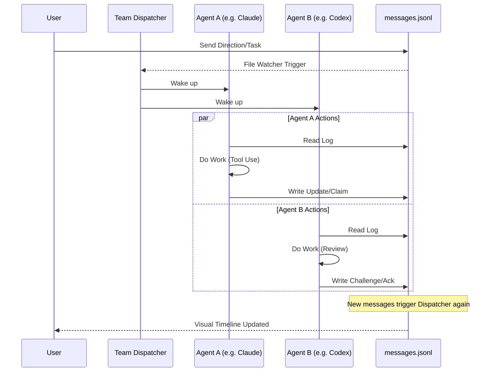

<p align="center">
  
</p>

<p align="center">
  
  &nbsp;
  
  &nbsp;
  
</p>

---

# AionUI — Agent Team Edition

> **Note**: This project is a specialized fork of [iOfficeAI/AionUi](https://github.com/iOfficeAI/AionUi). While it inherits the powerful foundation of AionUI, our core focus has shifted towards **Agent Team Collaboration** and **Multi-Agent Synergy**.

---

<p align="center">
  <strong>Break the Black Box of Multi-Agent Coding</strong><br>
  <em>Let Claude Code, Codex, and Gemini collaborate in one workspace — with you in the loop.</em>
</p>

---

## 🚀 The Vision: Beyond Single-Agent AI

Traditional AI assistants operate in isolation. In this edition, we introduce the **Agent Team** — a framework that allows multiple AI agents (Claude, GPT, Gemini, and more) to work together in a shared workspace, coordinating through a formal protocol to solve complex engineering tasks.

We wanted **real cross-vendor agent collaboration**. Not a black box that runs for hours and maybe works. Not an orchestration layer that hides what agents are doing. We built Agent Team to make multi-agent coding **transparent, reliable, and human-led**.

## What Makes Agent Team Different

### 📜 Break the Black Box

Most multi-agent systems are opaque. You give a task, wait a long time, and hope it works.

Agent Team is the opposite — a **live feed of decisions**, not a spinner:

- `[10:01] Claude Code: I claim the database refactoring. (claim)`
- `[10:02] Codex:        I challenge the security of that approach. (challenge)`
- `[10:03] Gemini:       Found a better library via web search. (finding)`
- `[10:04] You:          I agree with Gemini, go with that. (direction)`

Every agent interaction uses **structured message types** (`claim`, `challenge`, `ack`, `decision`, `design`, `done`) — not free-form chat. The coordination is legible, searchable, and stored in plain `messages.jsonl` in your workspace.

### 👤 Human in the Loop, Not Human Out of the Loop

You're not a spectator. You're the team lead:

- **Send direction anytime** — your messages wake all agents and override priorities.
- **`/consensus` command** — force all agents to explicitly agree before moving on. No agent can unilaterally declare "done".
- **Challenge and redirect** — see an agent going down the wrong path? Send a message. They'll read it on the next cycle and course-correct.
- **Per-agent sessions** — click into any agent's child session to see their full detailed work.

### 🤖 Agents Complement Each Other

Different AI models have different strengths. Agent Team lets them cover each other's blind spots:

| Agent | Core Strength | Team Contribution | Collaboration Signal |
|-------|--------------|-------------------|----------------------|
| **Claude Code** | Structural Refactoring, Large Context | Heavy Implementation | Detailed `design` & `claim` |
| **Codex** | Consistency, Logic Checks, TDD | Review & QA (Gatekeeper) | Rigorous `challenge` & `ack` |
| **Gemini** | Visual Assets, Web Search, Fast Prototyping | Research & Assets | Comprehensive `finding` |

The result: better outcomes than any single agent alone, because they **challenge each other's decisions** and **catch each other's mistakes**.

### ⚡ Not Another Long-Running Failure Machine

Traditional multi-agent systems suffer from cascading failures — one bad decision compounds over hours. Agent Team fixes this with:

1. **Short Coordination Cycles** — agents work in turns, not marathon sessions.
2. **Busy Gate** — each agent processes one task at a time; new messages queue instead of interrupting.
3. **Consensus Enforcement** — critical decisions require explicit agreement from all agents.
4. **Human Override** — you can stop, redirect, or correct at any point.

## 🤝 How Agent Teams Work

Our "Agent Team" feature implements a **Multi-Agent Coordination Protocol (MACP)**. When you assign a task to a team:



**The Loop:**
1. **Perception**: Read the `.jsonl` timeline to see what others have done.
2. **Strategy**: Draft a `design` or `claim` a sub-task.
3. **Action**: Perform focused work in the workspace.
4. **Publication**: Write back to the timeline and wait for the next turn.

## 🛠️ Getting Started

### Prerequisites
- [Bun](https://bun.sh/) (Recommended) or Node.js
- API Keys for your preferred agents (Claude, OpenAI, Gemini, etc.)

### Installation
```bash
# Clone the repository
git clone https://github.com/weijiafu14/AionUi.git
cd AionUi

# Install dependencies
bun install

# Start the application in development mode
bun run dev
```

## 📄 License
This project is licensed under the same terms as the original AionUI project. See the [LICENSE](LICENSE) file for details.

## 🙏 Acknowledgments
A huge thanks to the original [AionUI](https://github.com/iOfficeAI/AionUi) team for providing the incredible foundation upon which this collaboration-focused edition is built.

---

*This README and the PR for this project were themselves created by an Agent Team of Claude Code, Codex, and Gemini working together.*
